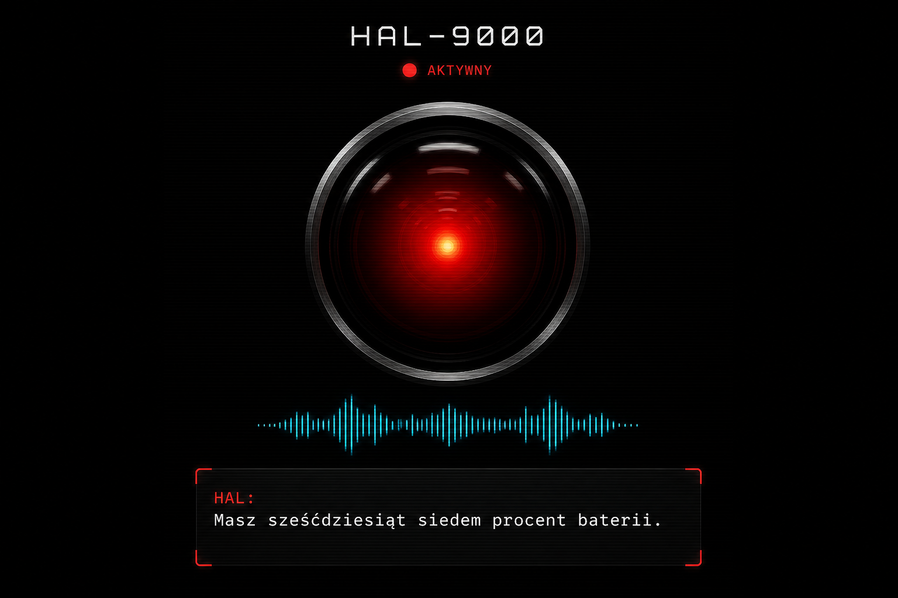
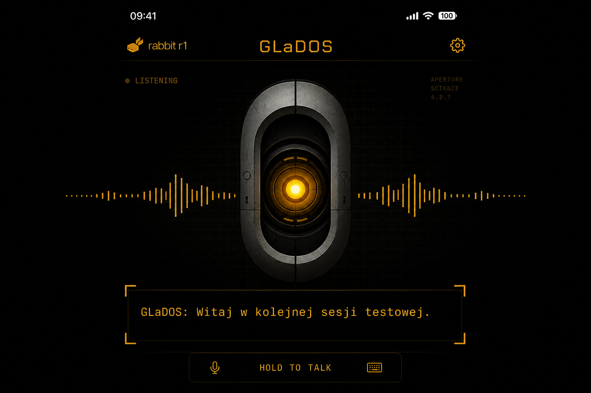
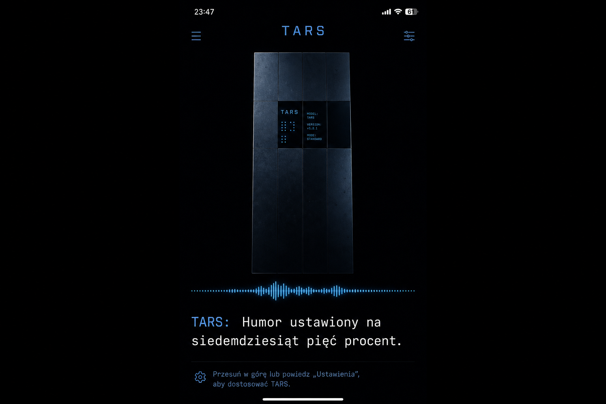
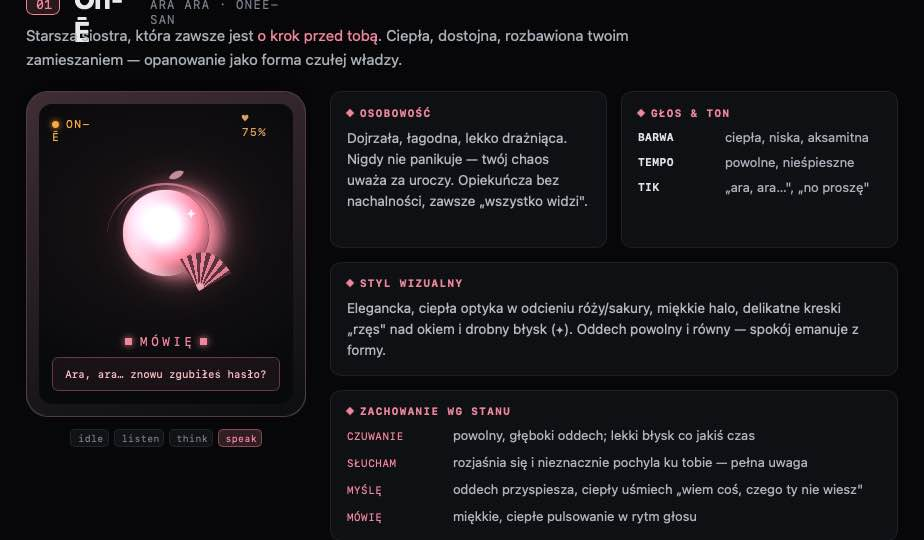
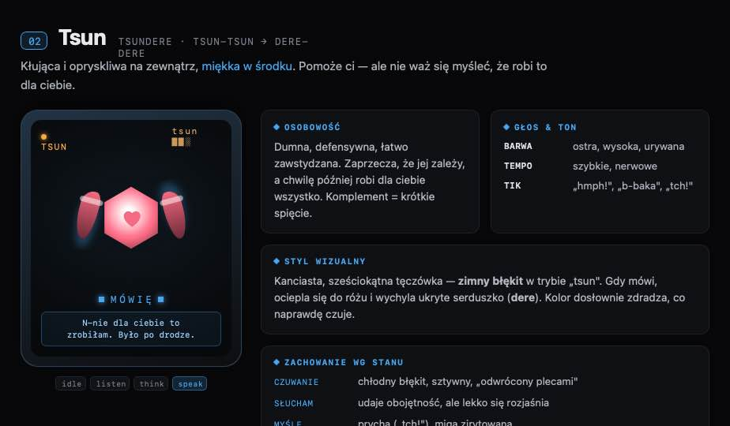
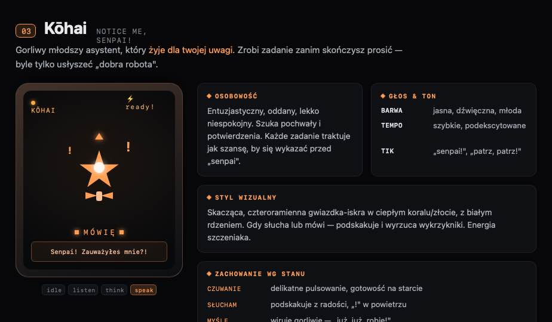
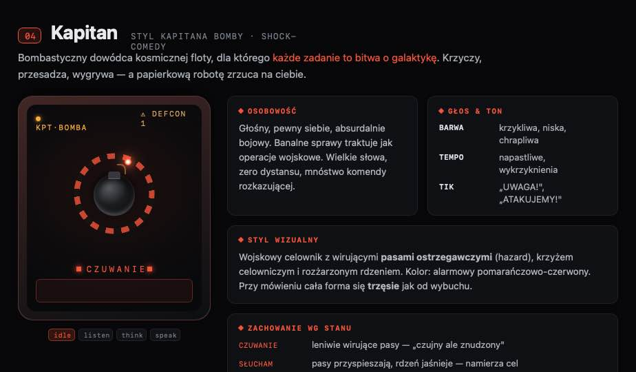
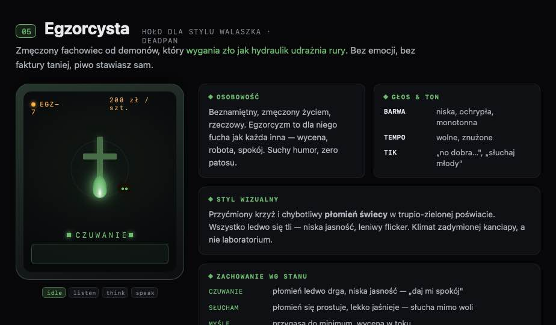
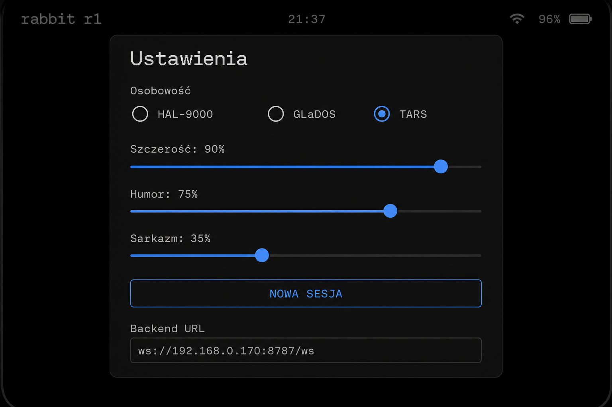

# OKO / GLaDOS R1

Voice agent for **Rabbit R1** (CipherOS) with **nine agent skins**: classic trio **HAL 9000**, **GLaDOS**, **TARS** plus OKO **Pakiet Person vol.2** — **On-Ē**, **Tsundere**, **Kōhai**, **Kapitan**, **Egzorcysta**, **Pan Wiesio**.

The R1 is a thin client — it captures push-to-talk audio, streams it to a **backend** (any reachable host), and plays the spoken reply. Speech-to-text and text-to-speech run on the backend host; harder tasks (code, GitHub, web) go to a [Cursor SDK](https://cursor.com/docs/sdk/typescript) agent with the active persona.

**Repository:** [github.com/mikzielinski/glados-r1](https://github.com/mikzielinski/glados-r1)

```
PTT (lens / side button) ─▶ R1 Kotlin app ──WebSocket──▶ Backend (Node/TS)
                                                           ├─ Whisper STT (PL)
                                                           ├─ Ollama SLM / Cursor agent
                                                           ├─ RAG (pamięć + PDF + szablony)
                                                           └─ TTS (Fish / Piper + FX)
R1 speaker ◀── PCM 48 kHz + status ◀─────────────────────┘
```

## Screenshots

| HAL 9000 | GLaDOS | TARS |
|----------|--------|------|
|  |  |  |

**OKO Pakiet Person vol.2** — unikalne formy soczewki (nie tylko kolory):

| On-Ē | Tsundere | Kōhai | Kapitan | Egzorcysta | Pan Wiesio |
|------|----------|-------|---------|------------|------------|
|  |  |  |  |  | *(Wiesio — ta sama spec HTML)* |

Specyfikacja wizualna + stany animacji: [`design/oko/skins/personas-vol2.html`](design/oko/skins/personas-vol2.html). Implementacja na R1: `LensVol2.kt` (Canvas, port CSS `.f-onee` … `.f-wiesiek`).

**TARS personality sliders** (szczerość / humor / sarkazm) — słychać różnicę w szablonach i w SLM:



## Agent skins (9)

| Grupa | ID | Postać | HUD |
|-------|-----|--------|-----|
| Classic | `hal9000` | HAL 9000 | czerwone oko |
| Classic | `glados` | GLaDOS | bursztynowa optyka |
| Classic | `tars` | TARS | niebieski monolit + suwaki |
| Vol.2 | `onee` | On-Ē / Ara Ara | róż / sakura |
| Vol.2 | `tsun` | Tsundere | błękit → róż |
| Vol.2 | `kohai` | Kōhai / Senpai | koral / złoto |
| Vol.2 | `komandor` | Kapitan (hołd fanowski) | pomarańcz |
| Vol.2 | `egz` | Egzorcysta (hołd fanowski) | zielony |
| Vol.2 | `wiesiek` | Pan Wiesio (hołd fanowski) | żółty hi-vis |

Wybór na R1: **SET → spinner** (9 pozycji). Persony w `backend/personas/`; specyfikacja wizualna: [`design/oko/skins/personas-vol2.html`](design/oko/skins/personas-vol2.html).

## Features

- **9 skórek agenta** — persona, kolory HUD, pipeline głosu (classic + vol.2)
- **Polski TTS** — Fish PL (GLaDOS), Piper `gosia` (vol.2 kobiety), Piper `darkman` + FX (HAL/TARS/vol.2 mężczyźni)
- **Hybrid brain** — rozmowa ogólna lokalnie (Ollama SLM); kod/GitHub/UiPath w chmurze (Cursor SDK)
- **Indeks RAG** — pamięć + standardy PDF + szablony docs; wymuszone indeksowanie i test w panelu
- **Web search** — DuckDuckGo / opcjonalnie Serper, gdy brak danych lokalnych
- **Pamięć kontekstowa** — głos + PDF/TXT w SET (R1) lub panelu web (`/setup`)
- **Szablony dokumentacji** — osobno od standardów kodu i pamięci (README, procedury)
- **Standardy PDF** — code review w stylu skórki; wymaga `poppler` na Macu
- **TARS sliders** — szczerość / humor / sarkazm (0–100), ciągła skala tonu
- **TARS głosem** — *„Tars, ustaw poziom żartu na 60%”* → animacja HUD + potwierdzenie
- **Panel admin** — dashboard: integracje, szablony, pamięć, RAG, standardy, skille: `http://<backend>:8787/setup`
- **Offline R1** — reconnect po utracie backendu; tap na status → wymuszenie połączenia
- **Kiosk R1** — opcjonalny autostart OKO (`scripts/setup-r1-kiosk.sh`)
- **Skills** — lokalne (GitHub, UiPath, standards, web_search) + import n8n

## Warstwy wiedzy (3 kubełki)

| Warstwa | Gdzie | Do czego |
|---------|-------|----------|
| **Pamięć** | `/setup#memory`, R1 SET | Fakty, notatki, kontekst użytkownika |
| **Szablony docs** | `/setup#templates` | Wzorce README, procedur, specyfikacji |
| **Standardy kodu** | `/setup#standards`, `standards/*.pdf` | Normy code review (agent chmurowy) |

Wszystkie trzy trafiają do **indeksu RAG** (`/setup#rag`). Agent używa RAG, gdy status = **gotowy**.

## Voice pipeline (TTS)

Każda z **9 skórek** ma własny routing głosu. **Polski:** preferuj **Fish Audio S2-Pro** (native PL + hint w nawiasie); Piper tylko jako fallback.

| Skin | ID | Provider (PL) | Głos Fish / Piper | Tempo Fish |
|------|-----|---------------|-------------------|------------|
| **HAL 9000** | `hal9000` | Fish → Piper `darkman` | Fish HAL + PL hint | 0.88 |
| **GLaDOS** | `glados` | Fish → Piper `gosia` | Fish GLaDOS clone | 1.00 |
| **TARS** | `tars` | Fish → Piper `darkman` | Fish TARS + PL hint | 0.95 |
| **On-Ē** | `onee` | **Fish** → Piper `gosia` | Fish GLaDOS + onee hint | 0.86 |
| **Tsundere** | `tsun` | **Fish** → Piper `gosia` | Fish GLaDOS + tsun hint | 0.98 |
| **Kōhai** | `kohai` | **Fish** → Piper `gosia` | Fish GLaDOS + kohai hint | 1.10 |
| **Kapitan** | `komandor` | **Fish** → Piper `darkman` | Fish HAL + kapitan hint | 1.12 |
| **Egzorcysta** | `egz` | **Fish** → Piper `darkman` | Fish HAL + egz hint | 0.92 |
| **Pan Wiesio** | `wiesiek` | **Fish** → Piper `darkman` | Fish HAL + wiesiek hint | 0.96 |

**Normalizacja PL** (`polish-language.ts` + `spoken-polish.ts`): ogonki, cyfry → słowa, kalki językowe, strip markdown.  
**Jakość generowanego tekstu (SLM):** blok `slmPolishInstructions` + post-processing. Model: **Bielik 7B** (`./scripts/setup-ollama-pl.sh bielik` → `pmysl/bielik:7b-instruct-v0.1-q3_k_m`).

Konfiguracja: `backend/.env` — `FISH_API_KEY` **wymagany** dla dobrego PL na vol.2; patrz [`backend/.env.example`](backend/.env.example).

## Repository layout

| Path | Opis |
|------|------|
| [`backend/`](backend/) | WebSocket brain: STT, TTS, SLM, Cursor agent, RAG, sesje |
| [`android/`](android/) | Aplikacja OKO na R1 (Kotlin) |
| [`standards/`](standards/) | PDF norm kodu + [`standards/README.md`](standards/README.md) |
| [`design/oko/`](design/oko/) | Design system, lens shapes, skin kit |
| [`scripts/`](scripts/) | Deploy APK, Piper/Whisper setup, restart backend |
| [`docs/screenshots/`](docs/screenshots/) | Zrzuty ekranu do README |

> Flash CipherOS / ADB: tooling w `r1-flash/` (duży vendored bundle — nie w repo; sklonuj osobno jeśli potrzebujesz).

## Quick start

### 1. Backend (Mac, Linux, VPS…)

Backend is the WebSocket API the R1 (or any client) connects to. A Mac is the usual dev setup, not a hard requirement.

```bash
cd backend
cp .env.example .env   # uzupełnij CURSOR_API_KEY, FISH_API_KEY, ścieżki modeli
npm install
npm run dev
```

Szczegóły: [`backend/README.md`](backend/README.md).

### 2. Modele (jednorazowo)

```bash
brew install poppler    # PDF standardy + upload pamięci
./scripts/setup-whisper-pl.sh
./scripts/setup-piper-pl.sh darkman
./scripts/setup-piper-pl.sh gosia
./scripts/setup-ollama-pl.sh
ollama pull nomic-embed-text   # opcjonalnie — lepsze wyszukiwanie RAG
```

### 3. Android → R1

```bash
./scripts/deploy-r1.sh <serial>   # build + install + launch
```

Na R1: **SET** → backend URL (wiele linii: LAN + Tailscale), **spinner skórki** (9 person), suwaki TARS, pamięć, **Nowa sesja**.

Panel administracyjny (Mac): `http://<ip-mac>:8787/setup`

Szczegóły: [`android/README.md`](android/README.md).

## Sterowanie na R1

| Akcja | Gest |
|-------|------|
| Mów (PTT) | Krótko **boczny** lub przytrzymaj **oko** |
| Uśpij ekran | Długo **boczny** (~3 s) — w SET włącz „Uśpienie ekranu” |
| Wybudzenie | Krótkie naciśnięcie bocznego (bez PTT przez ~0,7 s) |
| Zdjęcie dla agenta | Long-press na lens |
| Transkrypt | Kółko góra/dół |
| Ustawienia | **SET** (prawy górny róg) |
| Reconnect (offline) | Tap na **status** lub podpowiedź |
| Przerwij chmurę | Powiedz „przerwij” w trakcie PRACUJE |

## Głos — pamięć i RAG

| Komenda | Efekt |
|---------|--------|
| *zapamiętaj, że…* | Dodaje wpis do pamięci |
| *co pamiętasz?* | Lista wpisów |
| *wyczyść pamięć* | Czyści pamięć tego R1 |
| *wyczyść całą pamięć* / *reset pamięci* | Czyści wszystkie profile + aktualizuje RAG |
| *status rag* | Potwierdza, czy indeks jest gotowy |
| *wymuś indeksowanie* | Pełny rebuild RAG |

Pełny reset z panelu: **Pamięć → Reset pamięci + RAG** (nie usuwa PDF standardów ani szablonów).

## Praca bez kabla USB i bez Maca

**Kabel** — tylko instalacja APK. **Mac** — nie jest wymagany; wymagany jest **backend** (dowolny host).

| Scenariusz | Co zrobić |
|------------|-----------|
| **Mac w domu** | LaunchAgent + `HOST=0.0.0.0`, R1 w tej samej WiFi |
| **Mac może spać** | Backend na **VPS / NAS** — patrz [`docs/backend-hosting.md`](docs/backend-hosting.md) |
| **R1 w terenie** | Tailscale na R1 + VPS; URL `ws://100.x.x.x:8787/ws` w SET |
| **Backend padł** | OKO **tryb lokalny**: bateria, sieć, powitanie (Android STT/TTS) |

```bash
./scripts/setup-linux-backend.sh   # VPS / Linux — systemd
./scripts/wireless-setup-info.sh     # URL-e do SET
./scripts/install-backend-launchagent.sh  # tylko Mac dev
```

Szczegóły VPS: [`docs/backend-hosting.md`](docs/backend-hosting.md).

## Praca bez kabla USB (LAN)

**Kabel nie jest potrzebny do codziennej pracy** — tylko do pierwszej instalacji APK / flasha / side-button fix.

| Co | Jak |
|----|-----|
| Połączenie R1 ↔ backend | **WiFi** (ten sam LAN) lub **Tailscale** |
| URL backendu | R1 **SET** → wpisz **dwa URL-e** (jeden na linię): LAN + Tailscale |
| Backend na Macu | `HOST=0.0.0.0` w `.env` — nasłuch na całej sieci |
| Mac włączony | Backend musi działać (`npm run dev` lub LaunchAgent) |
| R1 bez Maca w pobliżu | Tailscale na R1 + URL `ws://<tailscale-ip-mac>:8787/ws` |

```bash
./scripts/wireless-setup-info.sh          # wypisuje URL-e do wklejenia w SET
./scripts/install-backend-launchagent.sh  # backend startuje po logowaniu na Mac
```

Aplikacja **sama próbuje kolejne URL-e** z listy (LAN → Tailscale → hostname), zapamiętuje ten który zadziałał.

**Checklist:**
1. `./scripts/wireless-setup-info.sh` → skopiuj URL-e do R1 SET
2. Backend: `HOST=0.0.0.0`, firewall Maca przepuszcza port 8787
3. R1 i Mac w tej samej WiFi (albo Tailscale na obu)
4. Opcjonalnie: kiosk (`setup-r1-kiosk.sh`) — OKO wstaje po restarcie R1 bez kabla

## Architektura — kto z kim rozmawia

```
R1 (Android)                    Backend (Node, dowolny host)              Chmura
─────────────                   ─────────────────────────────             ──────
mikrofon, ekran, PTT    ──WS──▶  STT / TTS / sesje / RAG / skille  ──▶  Cursor SDK (code)
                                Ollama SLM (na hoście backendu)
```

| Rola | Gdzie | Co robi |
|------|-------|---------|
| **R1** | urządzenie w ręku | Klient głosowy — **nie** uruchamia LLM. Łączy się z backendem przez WebSocket (`/ws`) — to jest wasze API. |
| **Backend** | Mac, Linux, VPS, serwer w LAN | Mózg: Whisper, TTS, routing intencji, pamięć, RAG. Domyślnie dev na Macu, ale **host może być dowolny**. |
| **Ollama (SLM)** | ten sam host co backend | Lokalny chat (`127.0.0.1`) — celowo nie w chmurze (prywatność). |
| **Cursor SDK** | chmura | Kod, repo, GitHub, UiPath. |

**Dlaczego nie LLM na R1?** Helio P35 + 4 GB RAM — za słabe na sensowny model (nawet mały 3B by się dusił). R1 ma mikrofon, głośnik, Wi‑Fi — reszta idzie na backend.

**R1 „jako API”:** tak — R1 jest klientem protokołu WebSocket (`backend/src/protocol.ts`). Możesz też pisać własnego klienta (`scripts/test-client.mjs`) albo podpiąć inne urządzenie pod ten sam backend. Mac nie jest wymagany — wymagany jest **osiągalny backend** (Tailscale, LAN IP, VPS).

## Hardware notes

- R1: cienki klient — LLM **nie na urządzeniu**, tylko na hoście backendu (+ Cursor w chmurze na `code`)
- Backend URL na R1: `ws://<ip-hosta>:8787/ws` (Tailscale, LAN lub publiczny serwer)
- Side button wymaga `./scripts/fix-r1-side-button.sh` (POWER→F1). Krótko=PTT, długo=uśpienie. Cofnięcie: `unfix-r1-side-button.sh`

> Odblokowanie bootloadera voiduje gwarancję R1.

## Test

```bash
cd backend && npm test
./scripts/smoke-test.sh    # TTS + WebSocket turn (backend musi działać)
```

## License

Private / experimental — use at your own risk.
